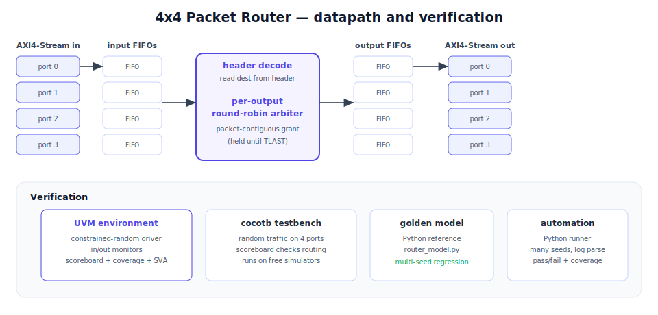

# 4x4 Packet Router with a UVM Verification Environment

A small packet switch written in SystemVerilog, plus the verification work
around it. The design routes AXI4-Stream packets between four input and four
output ports; the interesting part, and the reason I built it, is the
verification: a UVM environment with a constrained-random driver, monitors, a
scoreboard and functional coverage, backed by a Python golden model and an
automated multi-seed regression.

I built this as a design-verification (DV) project, so the router itself is kept
deliberately simple and the effort goes into proving it correct.



## The three layers

**1. RTL (SystemVerilog).**
`packet_router` reads each packet's header to find its destination, buffers it,
and forwards it whole to the right output. A per-output round-robin arbiter
grants one input at a time and holds the grant until the packet's TLAST, so two
packets never interleave on an output and no input is starved. It is built from
a reusable synchronous FIFO (`router_fifo`) and a round-robin arbiter
(`rr_arbiter`).

**2. Verification (UVM).**
The `router_pkg` UVM environment drives constrained-random packets on all four
inputs, watches the inputs and outputs with monitors, and checks everything in a
scoreboard: every packet must leave on the port named in its header, with its
flits intact and in order, and nothing may be lost or duplicated. A covergroup
tracks destinations, packet lengths and every source-to-destination pair.

**3. Automation (Python).**
A cycle-accurate Python model (`router_model.py`) is the golden reference, and
`scripts/run_regression.py` runs the whole thing across many random seeds,
self-checks each one, closes functional coverage, and returns a non-zero exit
code on any failure, which is exactly how a CI job gates a change.

## Results

The reference-model regression passes on every seed with full functional
coverage, exercising contention and FIFO-full conditions:

```
$ python scripts/run_regression.py --seeds 12 --packets 30
 ...
 Aggregate functional coverage: 100.0 %
   destinations reached : 4/4
   source->dest pairs   : 16/16
   packet lengths       : 8/8
   contention seen      : True
   output FIFO full seen : True
 12/12 seeds passed.
```

## How to run

```bash
# reference-model regression (needs only Python)
python scripts/run_regression.py --seeds 25 --packets 40

# RTL simulation with cocotb + a free simulator (iverilog or verilator)
cd verif/cocotb && make

# full UVM environment: run on a UVM-capable simulator (Questa, VCS, Xcelium)
# or free online at edaplayground.com. Top module: tb_top, files under verif/uvm.
```

## Repository layout

```
smartnic-router-dv/
├── rtl/
│   ├── packet_router.sv        # the switch
│   ├── router_fifo.sv          # sync FIFO
│   ├── rr_arbiter.sv           # round-robin arbiter
│   └── packet_router_flat.sv   # flattened wrapper for cocotb
├── verif/
│   ├── uvm/                     # UVM env: driver, monitors, scoreboard, coverage
│   │   ├── router_if.sv
│   │   ├── router_pkg.sv
│   │   └── tb_top.sv
│   └── cocotb/                  # cocotb testbench (free simulators)
│       ├── test_router.py
│       └── Makefile
├── model/router_model.py        # cycle-accurate golden reference
├── scripts/run_regression.py    # multi-seed regression + coverage report
└── docs/                        # architecture diagram + verification plan
```

## Tech

SystemVerilog · UVM · AXI4-Stream · functional coverage · constrained-random
verification · SVA · Python · cocotb · Icarus/Verilator

## Notes

The router is intentionally minimal (fixed flit width, header in the low bits,
no CRC). The point of the project is the verification methodology, not a
production switch. Natural next steps would be output back-pressure in the UVM
test, credit-based flow control, and a UVM RAL model if the router gained a
configuration register.

## License
Copyright 2026 Menahem Biton. All rights reserved. Shared for portfolio purposes.
